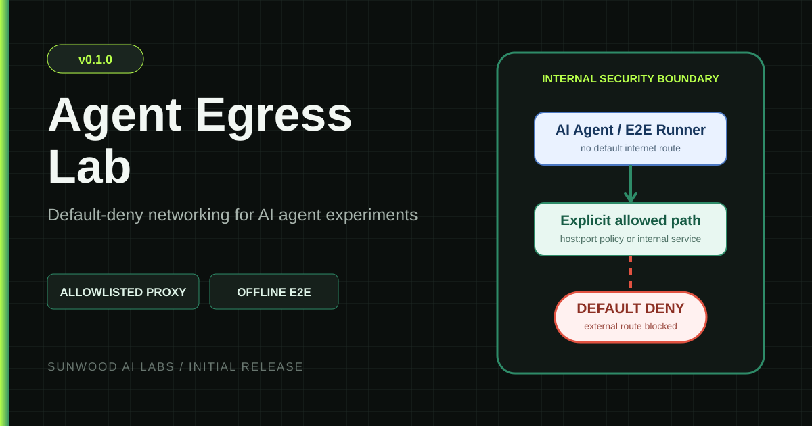
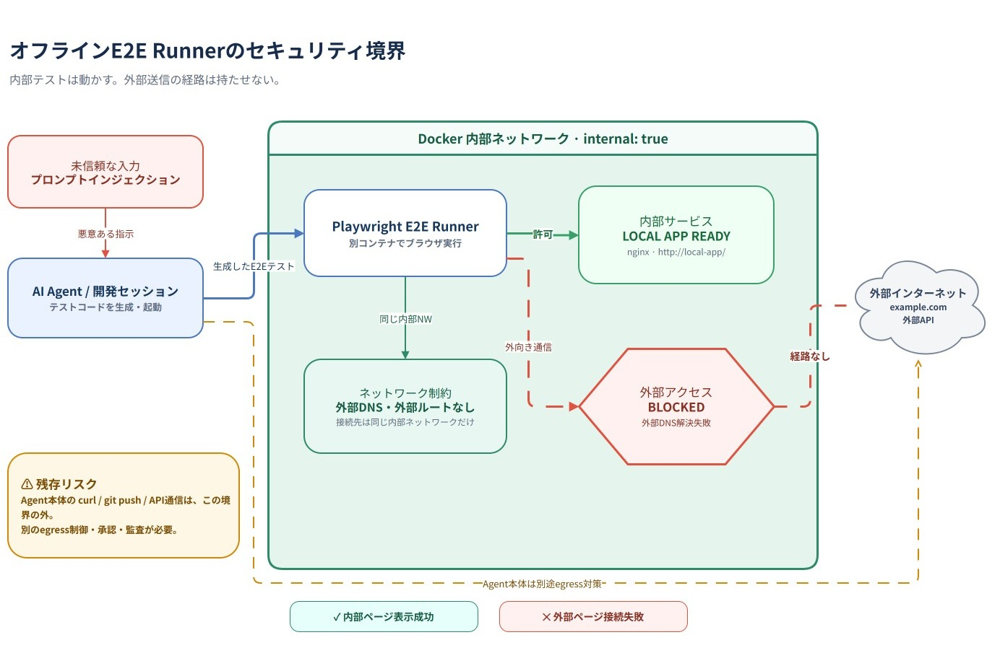

<div align="center">
  
  <h1>Agent Egress Lab</h1>
  <p><strong>A reproducible Docker lab for default-deny AI-agent egress and offline browser testing.</strong></p>

  <p>
    <a href="https://github.com/Sunwood-ai-labs/agent-egress-lab/releases/tag/v0.1.0"></a>
    <a href="https://github.com/Sunwood-ai-labs/agent-egress-lab/actions/workflows/ci.yml"></a>
    <a href="https://sunwood-ai-labs.github.io/agent-egress-lab/"></a>
    <a href="./LICENSE"></a>
  </p>

  <p><strong>English</strong> · <a href="./README.ja.md">日本語</a></p>
</div>

Agent Egress Lab demonstrates three complementary containment patterns:

- an AI-agent container with no direct internet route and a single allowlisted CONNECT-proxy path;
- a Playwright E2E Runner that can reach an internal test app but has no route to the public internet.
- a read-only fetch gateway that gives an internal research UI an allowlisted HTTPS GET/HEAD path while rejecting write methods.

This repository is an educational test fixture. It makes the network boundary and its residual risk visible; it is not a production security product.

## 🚀 Quick start

### Prerequisites

- Docker Engine or Docker Desktop with Docker Compose v2
- PowerShell 7 (`pwsh`)
- Internet access for the allowlisted verification target and initial image builds

Clone the repository and run all verification suites:

```powershell
git clone https://github.com/Sunwood-ai-labs/agent-egress-lab.git
cd agent-egress-lab
./verify.ps1
./verify-offline-e2e.ps1
./verify-readonly-fetch.ps1
```

Expected outcomes:

| Control | Expected result |
| --- | --- |
| Agent → internet directly | Blocked |
| Agent → `api.github.com:443` through the proxy | Allowed |
| Agent → `example.com:443` through the proxy | Denied with HTTP 403 |
| Offline E2E Runner → internal test app | Loaded |
| Offline E2E Runner → public page | Blocked with browser error evidence |
| Research Console → allowlisted HTTPS GET | Allowed through the fetch gateway |
| Research Console → POST or non-allowlisted host | Denied with HTTP 405 or 403 |

The scripts save transient evidence under ignored `output/` and `artifacts/` directories. Run `./serve-report.ps1` after `./verify.ps1` to inspect the local report at `http://127.0.0.1:4173`.

## 🧭 Architecture



The editable source is [`docs/architecture/offline-e2e-security-boundary.drawio`](docs/architecture/offline-e2e-security-boundary.drawio). An SVG export is included for high-resolution reuse.

```text
agent-runner -- internal sandbox network --> egress-proxy --> internet
                                                |
                                                +-- allow api.github.com:443
                                                +-- deny everything else

Playwright E2E Runner -- internal-only network --> local test app
                     X no route to the internet
```

## 🛡️ Security model

The lab removes the default outbound route from the agent and browser-runner networks. The agent reaches external services only through the dual-homed proxy, which accepts CONNECT requests for explicitly configured `host:port` targets. The offline E2E network has no external bridge at all.

This limits reachable destinations, but it does not inspect payloads or make an allowed destination trustworthy. Prompt injection, compromised dependencies, or generated code can still exfiltrate data through an allowed API. Production systems also need scoped credentials, request-level policy, approvals, audit logs, rate limits, and hardened proxy infrastructure.

See the full [security model](https://sunwood-ai-labs.github.io/agent-egress-lab/guide/security-model) and [security policy](./SECURITY.md).

## 📚 Documentation

- [Getting started](https://sunwood-ai-labs.github.io/agent-egress-lab/guide/getting-started)
- [Security model](https://sunwood-ai-labs.github.io/agent-egress-lab/guide/security-model)
- [Offline Playwright E2E](https://sunwood-ai-labs.github.io/agent-egress-lab/guide/offline-e2e)
- [Read-only research gateway](https://sunwood-ai-labs.github.io/agent-egress-lab/guide/readonly-fetch)
- [v0.1.0 release notes](https://sunwood-ai-labs.github.io/agent-egress-lab/releases/v0.1.0)
- [v0.1.0 walkthrough](https://sunwood-ai-labs.github.io/agent-egress-lab/guide/articles/v0.1.0-walkthrough)

## 🗂️ Repository layout

```text
compose.yaml                 Default-deny agent and allowlisted proxy
offline-e2e.compose.yaml     Internal-only Playwright test environment
readonly-fetch.compose.yaml  Internal console plus read-only outbound gateway
demo/                        Interactive Offline Sprint Board sample app
research-console/            Interactive gateway policy console
proxy.py                     Minimal CONNECT-only test proxy
fetch_gateway.py             Allowlisted HTTPS GET/HEAD gateway
verify.ps1                   Three-control egress verification
verify-offline-e2e.ps1       Internal-success/external-failure browser check
verify-readonly-fetch.ps1    Read-allowed/write-denied browser verification
report/                      Local verification report UI
docs/                        Bilingual VitePress docs and architecture assets
```

## 🤝 Contributing

Issues and pull requests are welcome. Read [`CONTRIBUTING.md`](./CONTRIBUTING.md) before proposing a change, and report security concerns through the private process in [`SECURITY.md`](./SECURITY.md).

## 📄 License

Released under the [MIT License](./LICENSE).
