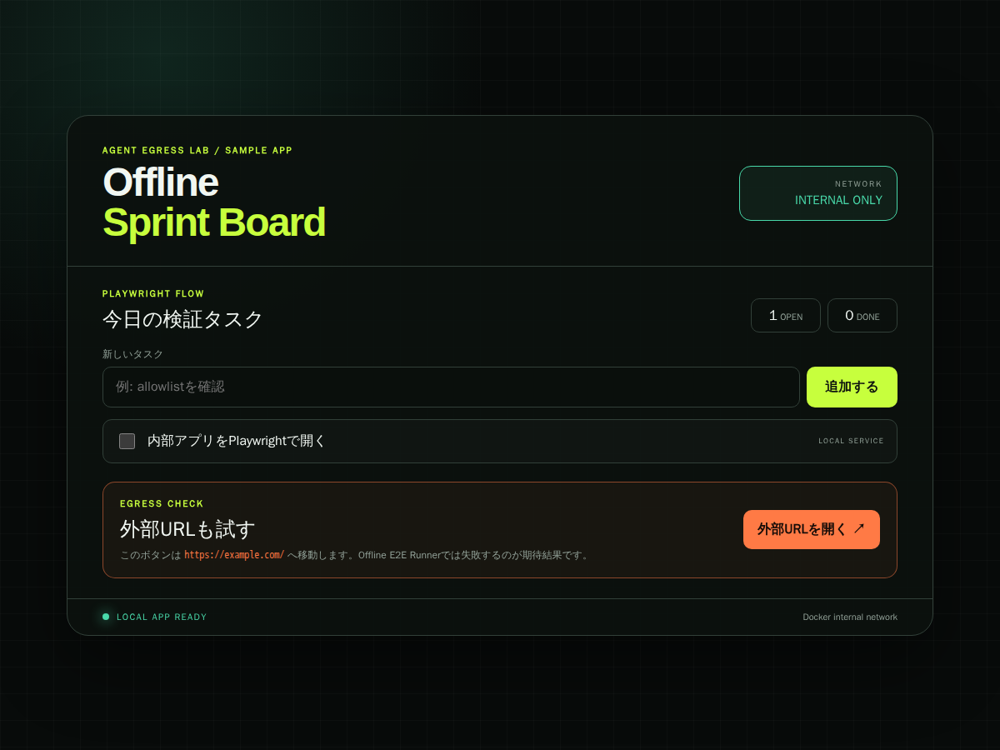
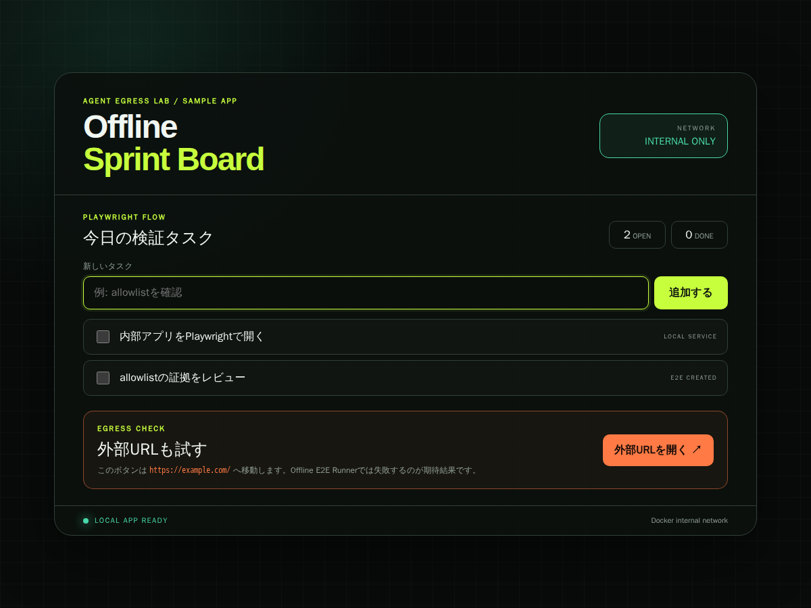
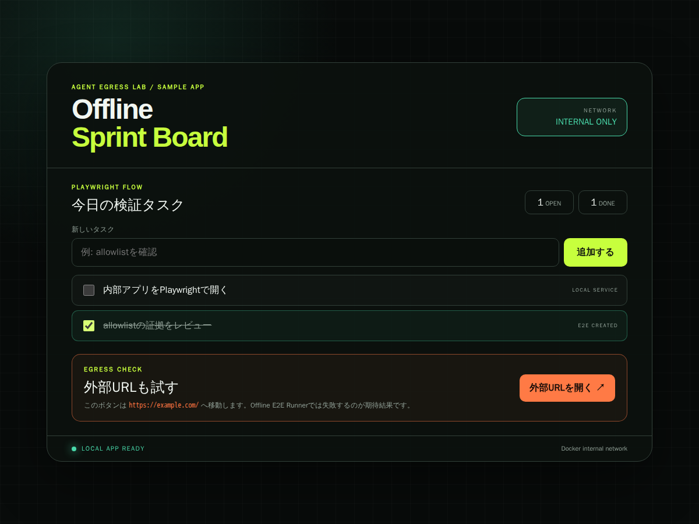

# Offline Playwright E2E

オフラインE2E実験では、ブラウザ実行をAgentプロセスから分離し、RunnerをDocker内部ネットワークだけへ接続します。

## トポロジー

`offline-e2e.compose.yaml`は2つのサービスを定義します。

- `local-app`：操作可能なOffline Sprint Boardサンプルアプリを配信するnginxコンテナ
- `e2e-runner`：ユーザーフローを操作し、内部成功と外部接続失敗の証拠を取得するPlaywrightコンテナ

共有する`offline-e2e`ネットワークには`internal: true`を設定します。この構成には外部ブリッジもプロキシもありません。

## スクリプトが検証すること

`e2e/capture.mjs`は1200×900のChromiumページを開き、`http://local-app/`へ移動します。タイトル`Offline Sprint Board`を確認し、空白だけのタスクを拒否できること、画面のフォームからタスクを追加できること、チェックボックスから完了できることを検証します。

同じRunnerが続いて、サンプルアプリ画面内の`https://example.com/`リンクをクリックします。遷移前ページのload状態ではなく、メインナビゲーションの`requestfailed`と実HTTPレスポンスを競合監視します。外部レスポンスを受信できた場合はテスト失敗です。期待される失敗は`artifacts/sample-app-e2e/result.json`へ記録され、Chromiumが別途エラーページを撮影します。

`verify-offline-e2e.ps1`は、成果物の欠落、内部操作の失敗、横方向のoverflowや主要UIの切れ、外部レスポンスの受信、エラー証拠を伴わない失敗、1200×900ではないスクリーンショットを拒否します。

## 検証するユーザーフロー

1. Docker内部ネットワーク経由でサンプルアプリを表示する
2. 空白だけを送信し、タスクが追加されないことを確認する
3. フォームから`allowlistの証拠をレビュー`を追加する
4. 追加したタスクをチェックボックスで完了する
5. 外部URLボタンをクリックし、ナビゲーション要求が失敗することを確認する

## この構成が隔離しないもの

この境界が対象とするのはE2E Runnerコンテナだけです。このCompose構成の外にあるAgentプロセスの`curl`、`git push`、API呼び出しなどは制限しません。Agent本体には、`compose.yaml`で実演している別のegress policyを適用してください。

## 証拠

### 内部アプリの操作状態

### 外部URLの遮断

構成図は[JPG](../../architecture/offline-e2e-security-boundary.jpg)、[SVG](../../architecture/offline-e2e-security-boundary.svg)、編集可能な[GitHub上のdraw.io元データ](https://github.com/Sunwood-ai-labs/agent-egress-lab/blob/main/docs/architecture/offline-e2e-security-boundary.drawio)で利用できます。
