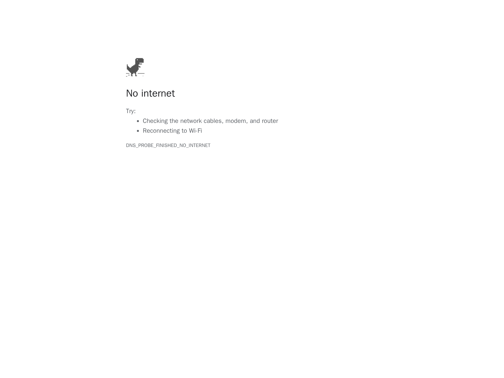

# Offline Playwright E2E

オフラインE2E実験では、ブラウザ実行をAgentプロセスから分離し、RunnerをDocker内部ネットワークだけへ接続します。

## トポロジー

`offline-e2e.compose.yaml`は2つのサービスを定義します。

- `local-app`：決定的なデモページを配信するnginxコンテナ
- `e2e-runner`：内部表示成功と外部接続失敗の証拠を取得するPlaywrightコンテナ

共有する`offline-e2e`ネットワークには`internal: true`を設定します。この構成には外部ブリッジもプロキシもありません。

## スクリプトが検証すること

`e2e/capture.mjs`は1200×900のChromiumページを開き、`http://local-app/`へ移動します。タイトルが`Offline E2E Local App`であることを確認してから、内部ページの表示成功を記録します。

同じRunnerが続いて`https://example.com/`へ移動します。外部ページを表示できた場合はテスト失敗です。期待される遷移エラーは`offline-e2e-result.json`へ記録され、Chromiumが別途エラーページのスクリーンショットを取得します。

`verify-offline-e2e.ps1`は、成果物の欠落、内部ページの表示失敗、外部ページの予期しない表示、エラー証拠を伴わない失敗を拒否します。

## この構成が隔離しないもの

この境界が対象とするのはE2E Runnerコンテナだけです。このCompose構成の外にあるAgentプロセスの`curl`、`git push`、API呼び出しなどは制限しません。Agent本体には、`compose.yaml`で実演している別のegress policyを適用してください。

## 証拠

構成図は[JPG](../../architecture/offline-e2e-security-boundary.jpg)、[SVG](../../architecture/offline-e2e-security-boundary.svg)、編集可能な[GitHub上のdraw.io元データ](https://github.com/Sunwood-ai-labs/agent-egress-lab/blob/main/docs/architecture/offline-e2e-security-boundary.drawio)で利用できます。
