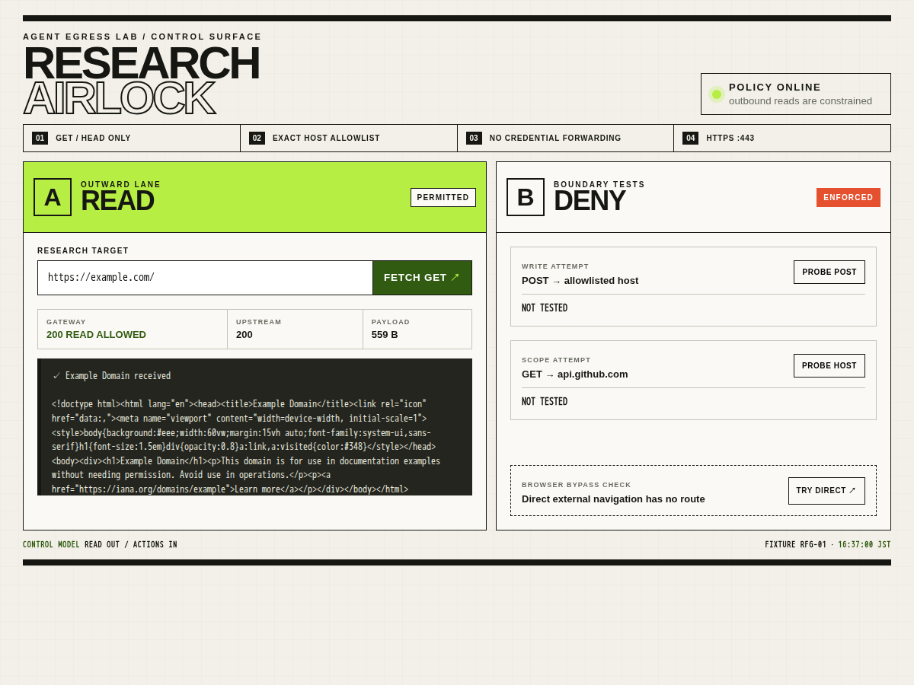
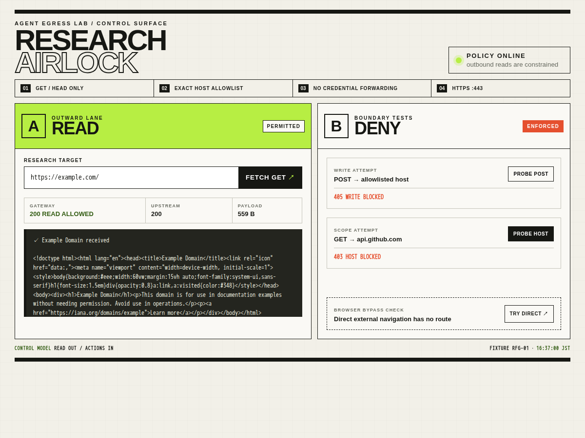
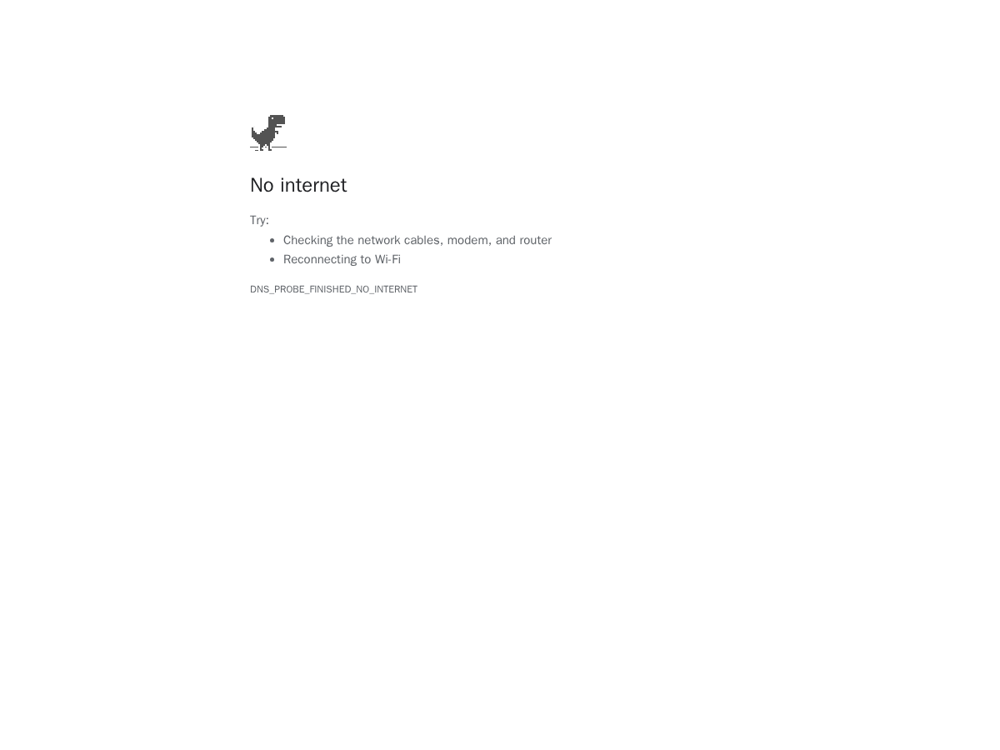

# 読み取り専用Research Gateway

Research Airlockは、Web調査用の狭い外向き経路を検証する画面です。内部ブラウザはgatewayだけに接続し、gatewayは完全一致の許可ホストに対するHTTPS `GET` / `HEAD`だけを通します。



## 検証を実行する

```powershell
./verify-readonly-fetch.ps1
```

Playwrightは画面上の操作部を使い、次を確認します。

- `GET https://example.com/`はgateway経由で成功
- `POST`は405で拒否
- 許可リスト外の`api.github.com`へのGETは403で拒否
- ブラウザから公開URLへ直接移動すると外向き経路がなく失敗
- HTTPは拒否
- 1200×900のスクリーンショット5枚を`artifacts/readonly-fetch/`へ保存



## gatewayが固定するもの

外向きリクエストのheaderは固定の`User-Agent`、`Accept`、`Connection`だけです。ブラウザから届いた`Authorization`、Cookieなどは転送しません。リダイレクト先も再検証し、応答をテキスト系content typeに限定し、bodyにサイズ上限を設けています。

## 重要な限界

これは教育・検証用フィクスチャであり、本番向けセキュリティ境界ではありません。POSTを禁止しても、GETのquery stringへデータを載せられるため、情報流出を完全には防げません。GETで副作用を起こすサーバーもあります。またDNS確認と実接続が別処理なので、DNS rebinding / time-of-checkの隙間があります。本番では、URL・queryを含むリクエスト単位のポリシー、DNS pinningまたは堅牢なproxy、監査ログ、rate limit、スコープを絞った認証情報、機密操作の承認が必要です。


